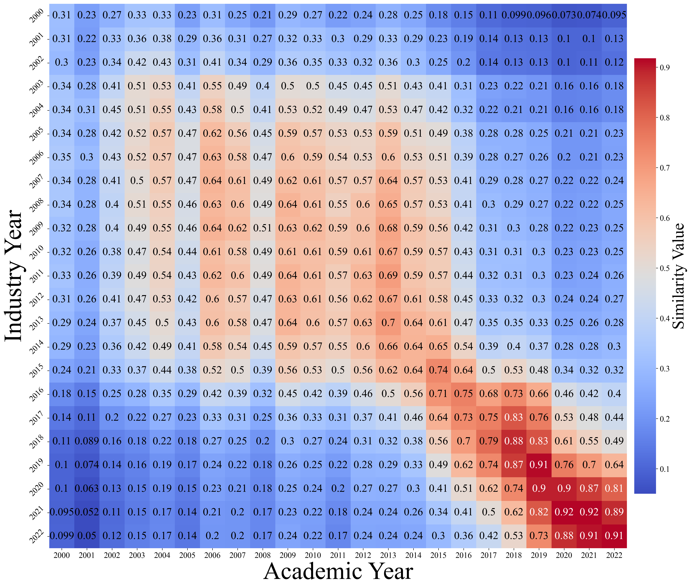
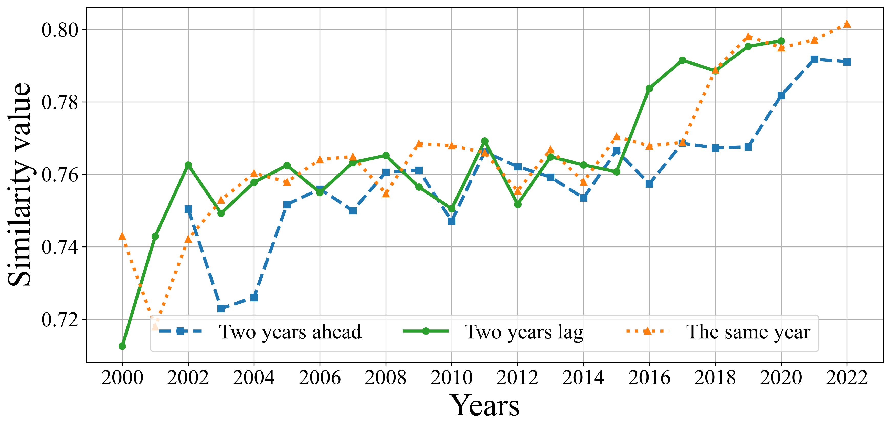
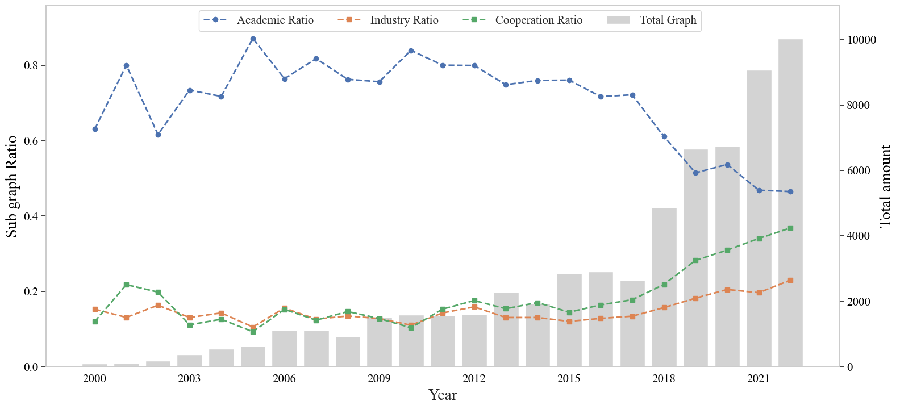

# Convergence or Divergence? Is the Knowledge Focused by Industry and Academia Consistent in the Field of NLP?
## Overview

**Dataset and source code for paper "Convergence or Divergence? Is the Knowledge Focused by Industry and Academia Consistent in the Field of NLP".**

This study analyzes the proximity between industry and academia since the 21st century from multiple perspectives. Our work includes the followig aspects:
  - We use the annotated data set to fine-tune NER model and select the best model for subsequent entity recognition. The proximity between academia and industry is measured through the entity composition bag of words vector.
  - We use SimCSE comparative learning to obtain the semantic vector obtained by splicing the title and abstract of the paper, and determine the similarity by searching for each other's nearest neighbor articles.
  - We measure the knowledge structure of proposed entity co-occurrence networks in academia and industry by calculating the largest connected subgraph in them.
  - We collected article references retrieved through PDF parsing and OpenAlex, analyzed the changing trends in citation frequency in different time periods, and explained some of the reasons for changes in similarity.

## Main findings
- In this study, we used more than 17,000 papers from three major ACL conferences from 2000 to 2022 to measure the similarity between academia and industry from the perspective of scientific entities and semantics.As depicted in Figure 1. We measure the similarity of bag-of-words vectors based on entity composition.
    - Between 2006 and 2015, the similarity between academia and industry exhibits an overall nearly rectangular structure, showing that there is still a high degree of similarity between the two even within a decade apart. Even if there were small fluctuations between 2008 and 2011, it can still reflect the relative stability of technology during this period.
    - Since 2018, the similarity shown in the heat map has increased sharply, and the similarity interval has gradually narrowed, indicating the rapid development of new technologies. Even data taken two years apart can have significant differences in similarity, once again emphasizing **the new energy and innovation that is being injected into the NLP field with the introduction of pre-trained models.**

    

    
    

    
<b>Figure 1. Entity similarity heat map</b>

- We plotted Figure 2 to compare the similarities of the three situations: current year, two year ahead and two year lag, in order to better capture the changes in similarity between the two, better understand the fluctuation trend in the degree of similarity, and judge the two Whether there is a certain lag in the research.

    

    
    

    
<b>Figure 2. Nearest neighbor industrial paper similarity searched from academia</b>

   - We consider entities mentioned in each paper to be related and construct an entity co-occurrence network. These entities are all normalized entities that appear in five or more papers. Then we went through different publishing institutions, namely industrial and academic institutions, and constructed annual industrial and academic sub-networks for them, as shown in Figure 3.

<b>Figure 3. Maximum connected subgraph and missing conditions under different mechanisms</b>

## Directory structure

<pre>
Academic-Industrial-associations                   Root directory
├─ subgraph analysis
│    ├─ analysis最大连通子图变化.ipynb
│    └─ 不同类型网络连边的特点.ipynb
├─ Reference analysis
│    ├─ describe.ipynb
│    └─ 参考文献_pyalex.ipynb
├─ data
├─ picture
│    ├─ academic_sim_industry.png
│    ├─ entity_similarity.png
│    ├─ industry_sim_academic.png
│    ├─ knowledge_structure_similarity.png
│    └─ subgraph_analysis.png
├─ semantic similarity
│    ├─ data
│    └─ 语义相似度.ipynb
└─ README.md
</pre>

## Dataset Discription

  - The paper is being sorted out and will be announced later.

## Quick Start

- <b>Semantic similarity</b>
    - <code>python 
    - <code>python 

- <b>Knowledge structure analysis</b>
  - <code>..
  - 
- <b>Reference analysis</b>
    - <code>.

## Dependency packages
System environment is set up according to the following configuration:
- pytorch 2.0.1
- transformers 4.28.1
- pandas 2.0.0
- pytorch-crf 0.7.2
- tqdm 4.65.0
- nltk 3.8.1
- numpy 1.24.1
- networkx 2.8.8
- matplotlib 3.8.3

## Citation
Please cite the following paper if you use this code and dataset in your work.
    
>Under preparation
